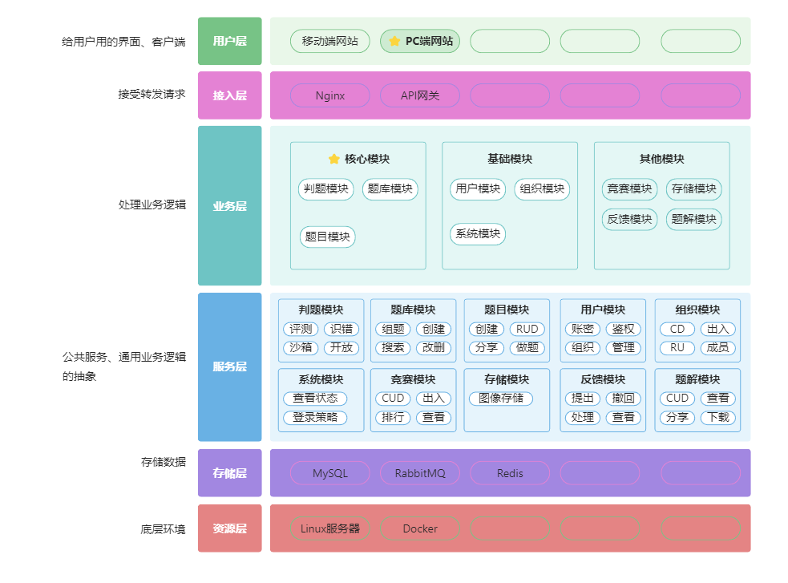

# JYU-OJ项目介绍
## 引言

JYU-OJ
本项目旨在开发一款在线的智能组题判题系统，专为有培训和练习**编程知识、算法题**的需求的用户设计。系统基于智能算法和代码沙箱技术，用户可在其中进行出题、组题、做题、分享题解，参与组织任务和竞赛题目等活动。

管理员拥有对系统配置和用户信息的适当管理权限。

系统提供智能组题、快捷出题、准确判题、组织管理、竞赛活动、用户管理、题解知识分享、AI对话、问题反馈等多项功能。具备多权限访问支持，实现了精确的功能管理。

# 一、技术选型 

## 1） 前端
1. Vue3
2. Vue-CLI 脚手架
3. Vuex 状态管理
4. Axios 请求处理
5. Arco Design 组件库
6. 前端工程化：ESLint + Prettier + TypeScript
7. 通用前端项目模板（通用布局、权限管理、状态管理、菜单生成）
8. Markdown 富文本编辑器
9. Monaco Editor 代码编辑器
10. OpenAPI 前端代码生成
## （2）后端
1.  Spring Boot 后端开发框架
2.  Spring Retry 重试机制
3.  Sa-Token 权限认证框架
4.  Spring Cloud Alibaba 微服务
5.  Nacos 注册中心
6.  OpenFeign 客户端调用
7.  GateWay 网关
8.  聚合接口文档Knife4j
9.  Java 进程控制
10.  Java 安全管理器
11.  Docker 代码沙箱自主实现
12.  虚拟机+远程开发
13.  MySQL 数据库
14.  Druid 数据连接池
15.  Mybatis-Plus以及Mybatis X自动生成
16.  Redis缓存数据库
17.  RabbitMQ 消息队列
18.  多种设计模式

     a. 策略模式

     b. 工厂模式

     c. 代理模式

     d. 模板方法模式
19.  JVM内存控制
20.  Python内存控制
21.  Minio对象存储
22.  SSE消息推送通信技术

# 二、软件架构

# 三、主要功能模块
### 1. 用户模块
   - 注册： 允许新用户创建账户并填写必要信息。
   - 登录： 提供安全的登录途径，确保用户能够访问个人账户。
   - 密码找回： 提供忘记密码时的找回机制，保障账户安全。
   - 信息查看与修改： 用户可以查看和修改个人信息，以保持信息的准确性。
   - 关注、取关： 提供关注和取关其他用户的功能，以建立用户之间的社交网络。
### 2. 题目模块
   - 智能出题与改题： 基于智能算法，系统能够生成和改进编程题目。
   - 在线做题： 提供用户在线解答题目的平台，记录用户的提交历史。
   - 查看提交结果： 用户能够查看他们的题目提交结果，包括通过或失败的状态。
   - 题解发布： 允许用户分享他们对题目的解答，促进知识分享。
### 3. 文章模块
   - 查看文章： 提供用户浏览系统内发布的文章的功能。
   - 分析文章： 支持用户对文章进行分析，以促进学术交流。
   - 点赞文章： 用户可以为喜欢的文章点赞，以表达赞同或支持。
   - 评论文章： 允许用户在文章下方发表评论，提供交流的平台。
   - 导出文章： 用户可以导出文章以便离线阅读或分享。
### 4. 题单模块
   - 题单创建与修改： 用户可以创建和修改题单，用于组织相关题目。
   - 题单权限说明： 系统提供详细的题单权限说明，确保合适的权限设置。
   - 题单信息查看： 用户可以查看题单的详细信息，包括包含的题目和权限设置。
### 5. 组织模块
   - 组织创建与修改： 用户可以创建和修改组织，建立自己的学术团体或社群。
   - 加入组织： 提供用户加入不同组织的入口，扩大社交圈。
   - 组织信息查看： 用户能够查看组织的详细信息，包括成员和活动。
   - 组织权限： 提供灵活的组织权限管理，确保组织内部运作顺畅。
   - 退出组织： 允许用户主动退出不再感兴趣的组织。
   - 转让组织： 组织管理员可以将组织的管理权限转交给其他成员。
   - 组织成员管理： 管理员可以查看和管理组织成员，确保组织的稳定运行。
### 6. 竞赛模块
   - 竞赛创建与修改： 用户能够创建和修改编程竞赛，设定相关参数。
   - 竞赛设置： 提供灵活的竞赛设置，包括时间、题目集、权限等。
   - 竞赛参与： 允许用户报名参与竞赛，挑战编程能力。
   - 竞赛成员管理： 竞赛管理员可以管理竞赛成员的权限和状态。
   - 竞赛排行榜统计： 实时更新竞赛成绩，提供排行榜展示。
### 7. 问题反馈与申请
   - 提交问题或申请： 提供用户一个途径向开发团队提交问题或提出申请。
   - 修改问题或申请： 允许用户修改之前提交的问题或申请。
   - 撤回反馈或申请： 用户有权撤回之前提交的问题或申请。
   - 查看申请进度： 提供用户查看问题反馈或申请处理进度的途径。
### 8. 系统配置
   - 服务器信息查看： 管理员可以查看服务器运行状态和信息。
   - 系统参数配置： 提供管理员配置系统参数的权限，以满足特定需求。
   - 系统操作日志管理： 记录系统的操作日志，以便后期审查。
   - 在线用户管理： 管理员能够查看和管理当前在线的用户。
   - 用户信息管理： 管理员可以查看和管理系统用户的基本信息。

四、访问地址:
[JYU-OJ](http://43.139.221.169/)

